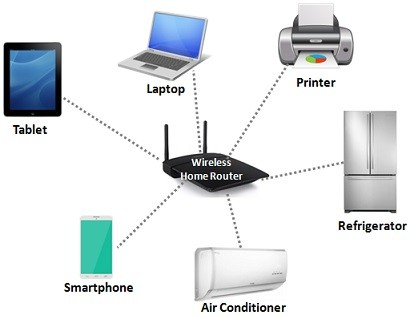
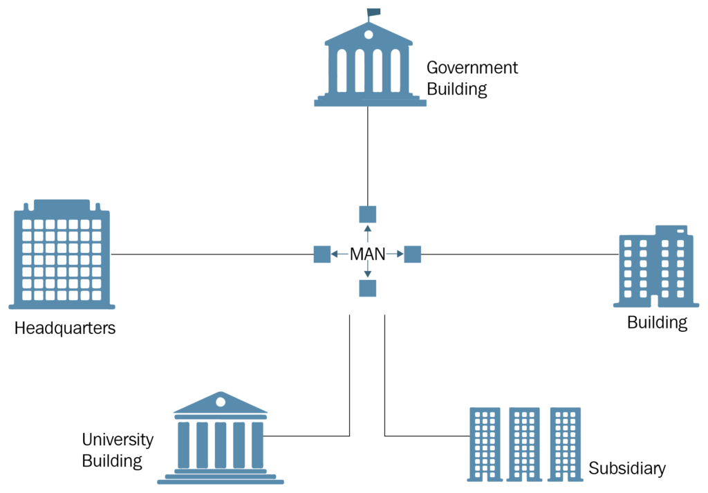
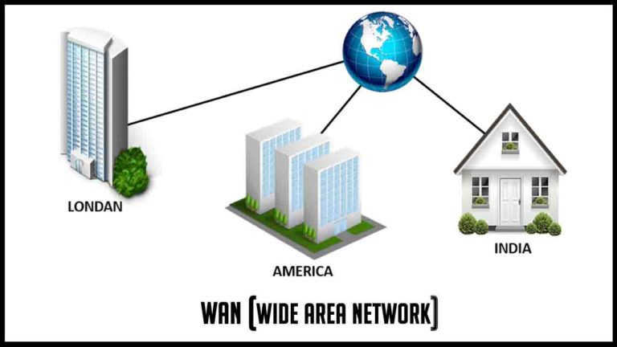

## Course Name : Advanced Web Fundamentals
## Course Duration : 25 Days
## Course Content : 
    # Basic Understanding 
        Networking
        Internet
        IP
        TCP
        Methodologies
        URL

    # Technologies
        HTML5
        CSS3
        JavaScript (Vanilla JS)
        ES6 (EcmaScript)
        API (Application Programming Interface)
        Git & Github (Version Control)
        Vercel (Frontend Hosting)

    First of all we need to understand some basic information like what is Client, Server, Nerwork, IP, etc.

## Basic Understanding

    # What is Network ?
    A network consists of two or more computers that are linked in order to share resources 
    (such as printers and CDs), exchange files, or allow electronic communications. The computers on a 
    network may be linked through cables, telephone lines, radio waves, satellites, or infrared light beams.
    
    assets/network.png

    LAN (Local Area Network) is a small network that is built within a small geographical area. A LAN can be your home network, your company’s network or any similar network that is consist of mostly with switches and the hosts connected to them. Beside, a LAN consist of different office equipments like printers. A LAN can consist of two computers simply, beside,it can consist of hundreds of devices.

    

    A Metropolitan Area Network (MAN) is a computer network that connects computers within a metropolitan area, such as a single large city, multiple cities/towns, or any large area with multiple buildings. A MAN is larger than a local area network (LAN) but smaller than a wide area network (WAN). MANs do not have to be in urban areas, the term “metropolitan” implies the size of the network, not the demographics of the area that it serves.

    

    It covers a wide geographical area that includes multiple computers or LANs. WAN connects computers through public networks, like telephone systems, microwaves, satellite links, or leased lines. Most of the WANs use leased lines for Internet access as they provide faster data transfer.

    

    ## H/W : Find the Difference between LAN, MAN, WAN and PAN ?

## Internet
    The Internet (or internet) is the global system of interconnected computer networks that uses the Internet protocol suite (TCP/IP) to communicate between networks and devices. It is a network of networks that consists of private, public, academic, business, and government networks of local to global scope, linked by a broad array of electronic, wireless, and optical networking technologies. The Internet carries a vast range of information resources and services, such as the interlinked hypertext documents and applications of the World Wide Web (WWW), electronic mail, telephony, and file sharing.

    # World Wide Web (WWW)
    The World Wide Web (WWW), often called the Web, is a system of interconnected webpages and information that you can access using the Internet. It was created to help people share and find information easily, using links that connect different pages together. The Web allows us to browse websites, watch videos, shop online, and connect with others around the world through our computers and phones.

    # What is an IP Address?
    All the computers of the world on the Internet network communicate with each other with underground or underwater cables or wirelessly. If I want to download a file from the internet or load a web page or literally do anything related to the internet, my computer must have an address so that other computers can find and locate mine in order to deliver that particular file or webpage that I am requesting. In technical terms, that address is called IP Address or Internet Protocol Address.

    # What is a Web Browser?
    The web browser is an application software to explore www (World Wide Web). It provides an interface between the server and the client and it requests to the server for web documents and services. It works as a compiler to render HTML which is used to design a webpage. Whenever we search for anything on the internet, the browser loads a web page written in HTML, including text, links, images, and other items such as style sheets and JavaScript functions. Google Chrome, Microsoft Edge, Mozilla Firefox, and Safari are examples of web browsers.

    # What is a Browser Engine?
    Think of a browser engine as the heart of your web browser. It is the essential software that acts as a bridge between the web page’s code (HTML, CSS, JavaScript) and the visual experience you see on your screen. Here’s what it does:

    * Starts the Process: The browser engine handles the initial request to load a web page and coordinates the     resources needed.
    * Navigation: It manages your browsing actions – things like going back, forward, or reloading.
    * Error Handling: The browser engine gracefully displays error messages if something goes wrong.
    * Visual Layout: It works behind the scenes, using HTML and CSS to calculate the precise position and appearance of every element on the page.

    H/W : Find out the browser engines of different browsers ?

## Client-Server Model

    The Client-server model is a distributed application structure that partitions tasks or workloads between the providers of a resource or service, called servers, and service requesters called clients. In the client-server architecture, when the client computer sends a request for data to the server through the internet, the server accepts the requested process and delivers the data packets requested back to the client. Clients do not share any of their resources. Examples of the Client-Server Model are Email, World Wide Web, etc.

    

    
    # Clients

        ---> User
        ---> Laptop, PC, Mobile
        ---> Browser
        ---> App
        ---> CLI (Command Line Interface)

    # Server

        ---> DB Server
        ---> File Server
        ---> App Server
        ---> Web Server
        ---> Email Server

    # What is Internet ?
        Inter                   Net
        Interconnected          Network             Network of Network

    # History
        1960's                  ----->      ARPANET
        1970's + 1980's         ---->       DNS (Domain Name Service) / DNR (Domain Name Resolution)
        1990's                  ----->      Email / Msg / Shopping
        2000's                  ----->      Facebook, Mobile Phones, 
        2020's                  ----->      All service 

    # Imagine -> Life without Internet ? 

    H/W     -->         ISP, Protocol Stack.

    # ISP
        Internet Service Provider.

    # Protocol
        Protocol is a Sets of rules.
        IP Address: 196.169.94.121
        Port: 3000, 5000, 8080, 5017
        196.169.94.121:3000

        http    -   Hyper Text Transfer Protocol
        https   -   Hyper Text Transfer Protocol Secure
        SMTP    -   Simple Mail Transfer Protocol
        FTP     -   File Transfer Protocol

        # H/W   - IPv4 , IPv6, why need IPv6?

    # Protocol Stack
        1. Application Layer
        2. Persentation Layer
        3. Session Layer
        4. Transport Layer
        5. Network Layer
        6. Data Link Layer
        7. Physical Layer

    # H/W      OSI Model, Router, Hub, switches, Modem

